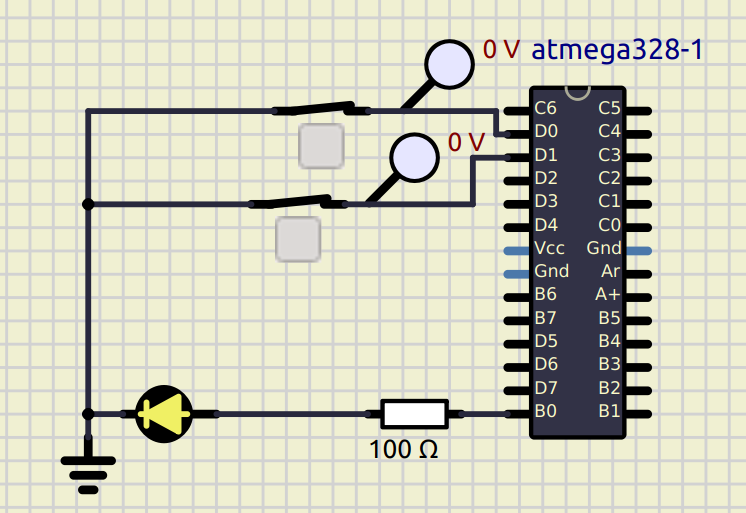
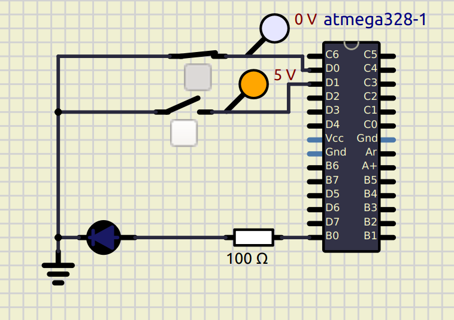

# Embedded C Programming with Continuous Integration and Code Quality

# LED control based on two buttons 

## In Action

|ON|OFF|
|:--:|:--:|
|||

#### CI and Code Quality

|Build|Cppcheck|Codacy|
|:--:|:--:|:--:|
||||
